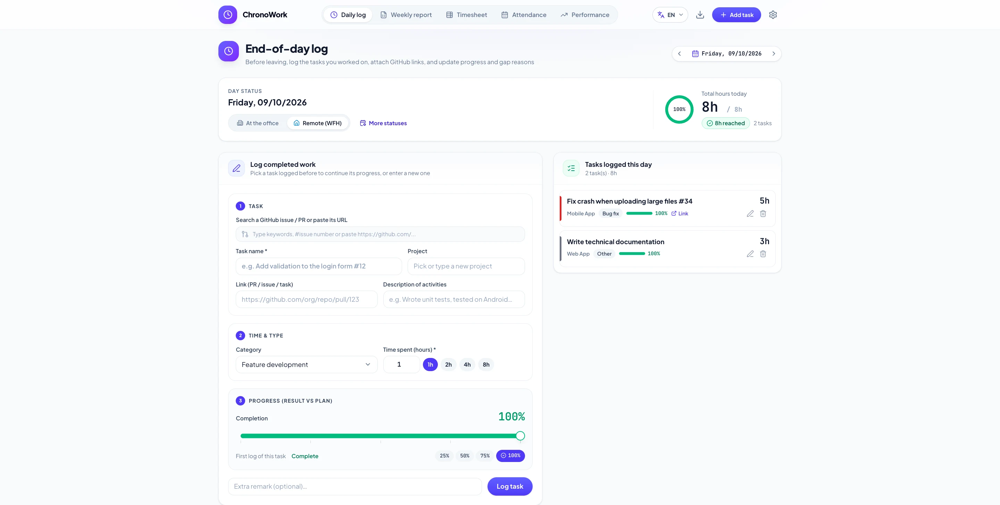
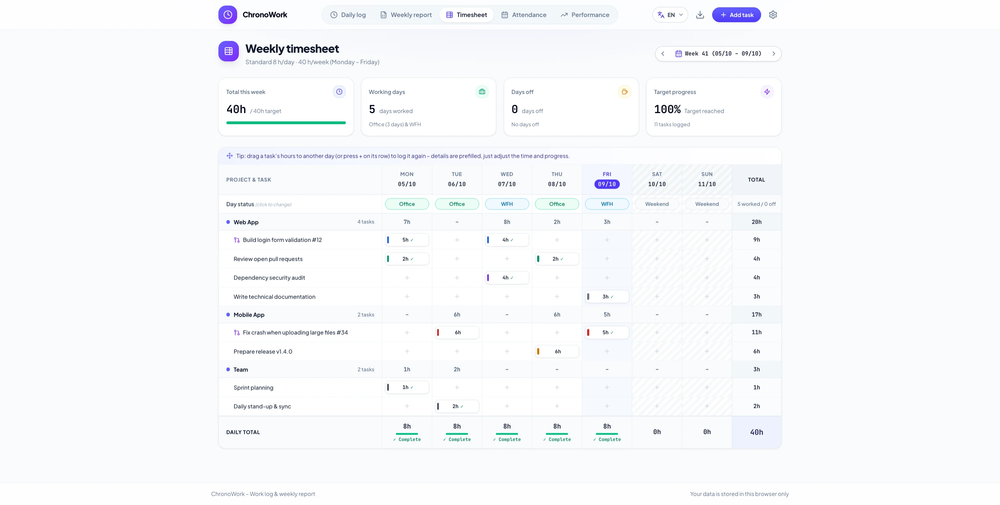
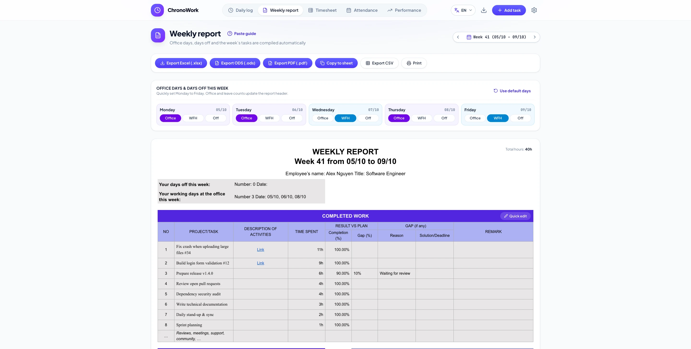
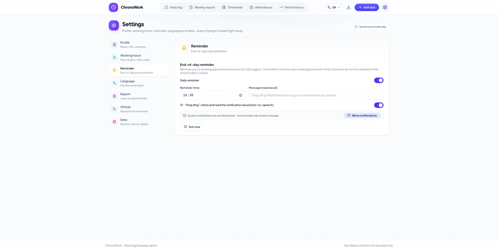

<div align="center">


<a href="https://dab246.github.io/ChronoWork/"></a>

End-of-day work log, weekly timesheet, attendance calendar, performance insights and a weekly report that exports to Excel, ODS, PDF and CSV, in Vietnamese, English and French.

<!-- Build and quality -->
[](https://github.com/dab246/ChronoWork/actions/workflows/ci.yml)
[](https://github.com/dab246/ChronoWork/actions/workflows/codeql.yml)
[](https://github.com/dab246/ChronoWork/actions/workflows/security.yml)
[](https://github.com/dab246/ChronoWork/actions/workflows/deploy-pages.yml)
[](https://react.dev)
[](https://www.typescriptlang.org)
[](https://vite.dev)
[](https://tailwindcss.com)

<!-- Community -->
[](https://github.com/dab246/ChronoWork/stargazers)
[](https://github.com/dab246/ChronoWork/network/members)
[](https://github.com/dab246/ChronoWork/watchers)
<br />
[](https://github.com/dab246/ChronoWork/issues)
[](https://github.com/dab246/ChronoWork/pulls)
[](https://github.com/dab246/ChronoWork/graphs/contributors)
[](https://github.com/dab246/ChronoWork/commits/main)
[](CONTRIBUTING.md)

[**Open the app**](https://dab246.github.io/ChronoWork/) · [User guide](docs/adr/0002-user-workflow-and-guide.md) · [Report a bug](https://github.com/dab246/ChronoWork/issues/new?template=bug_report.yml) · [Request a feature](https://github.com/dab246/ChronoWork/issues/new?template=feature_request.yml) · [Contribute](CONTRIBUTING.md)



</div>

## Why ChronoWork?

- **No account, no server, no tracking.** Everything stays in your browser (`localStorage`). The only network call is the optional GitHub issue / PR search.
- **Built for the weekly report.** Log tasks every evening; the report, with office days, days off, progress and gaps, writes itself in your company template.
- **Remembers your work.** Tasks you logged before are suggested as you type, and their progress carries over from day to day.
- **Never forget to log.** A reminder at 16:30 (configurable) with a notification and the message read aloud.

## Features

| | |
|---|---|
| 🕔 **Daily log** | GitHub issue / PR search, task name suggestions (case-insensitive), progress that carries over between days and locks at 100%, gap reason & solution |
| 🗓️ **Weekly timesheet** | Projects × days grid; **drag a task to another day** to log it again with everything prefilled |
| 📊 **Weekly report** | Company template; export to `.xlsx`, `.ods`, PDF, CSV, or copy with formatting into any spreadsheet; optional logo |
| 🏖️ **Attendance** | Office, WFH, leave, sick, holidays and overtime on a month calendar; leave lowers the weekly target |
| 📈 **Performance** | Weekly goal, deep-work ratio, completion rate, hours per day and tips |
| 🔔 **Reminder** | End-of-day notification, "ding ding" chime and text-to-speech message |
| ⚙️ **Settings** | One page per topic, saved as you type; JSON backup / restore |
| 🌐 **3 languages** | Vietnamese, English, French; the report has its own language |

<table>
  <tr>
    <td></td>
    <td></td>
  </tr>
  <tr>
    <td align="center"><sub>Weekly timesheet: drag & drop to continue a task</sub></td>
    <td align="center"><sub>Weekly report in the company template</sub></td>
  </tr>
  <tr>
    <td colspan="2"></td>
  </tr>
  <tr>
    <td colspan="2" align="center"><sub>Settings: one section per topic, saved automatically</sub></td>
  </tr>
</table>

## Quick start

**Just use it:** open **https://dab246.github.io/ChronoWork/**, then Settings → Data → **Load sample data** to see every screen with example content.

**Run it locally** (Node.js 24 LTS, or any `>=22.12`; [Bun](https://bun.sh) preferred since `bun.lock` is the committed lockfile):

```bash
git clone https://github.com/dab246/ChronoWork.git
cd ChronoWork
bun install
bun run dev        # http://localhost:3000
```

No `.env` file or other configuration is needed. How to use the app day to day is in the [user guide](docs/adr/0002-user-workflow-and-guide.md).

## Development

| Command | What it does |
|---|---|
| `bun run dev` | Dev server with hot reload on http://localhost:3000 (no CSP) |
| `bun run lint` | Type check (`tsc --noEmit`) |
| `bun run test` | Unit tests (Vitest + jsdom) |
| `bun run build` | Production build in `dist/`, with the Content-Security-Policy |
| `bun run preview` | Serve `dist/` on http://localhost:4173 |
| `scripts/run.sh check` | Lint + tests + build in one go: run it before every commit |

Without Bun, use npm with the same scripts and `npm install --no-package-lock`, so no second lockfile appears. `scripts/run.sh` checks your Node version and picks Bun or npm for you.

Good to know:

- Data is stored per origin, so the dev server (`:3000`) and the preview (`:4173`) do not share data. Move it with Settings → Data → Backup / Restore.
- The CSP only applies to the production build: check `build` + `preview` after touching scripts, styles, fonts, images or network calls.

### Tech stack

React 19 · TypeScript (strict) · Vite 8 · Tailwind CSS 4 · Motion · Lucide icons · Vitest · ExcelJS / jsPDF / JSZip (loaded on demand for exports).

### Project structure

```text
src/
├── App.tsx                 # Workspace shell: header, routes (#/daily, #/settings/…), dialogs
├── routing.ts              # Hash routes, no router dependency
├── components/             # One folder or file per screen
│   ├── settings/           # Settings page: one component per section + sections.ts registry
│   └── weeklyReport/       # Report preview, toolbar, guide
├── hooks/                  # Workspace data, daily reminder
├── report/                 # Report model and exporters (xlsx, ods, pdf, csv, html)
├── services/               # GitHub search, reminder (notification, chime, speech)
├── utils/                  # Dates, storage + sanitizers, task history, security helpers
├── i18n/                   # vi / en / fr strings (en and fr are type-checked against vi)
└── __tests__/              # Unit tests
docs/adr/                   # Architecture decisions and the user guide
```

Architecture decisions live in [`docs/adr/`](docs/adr/), release notes in [CHANGELOG.md](CHANGELOG.md).

## Quality gates

Every pull request and every push to `main` runs:

| Workflow | Checks |
|---|---|
| [CI](.github/workflows/ci.yml) | Locked install, type check, unit tests, production build (root and GitHub Pages sub-path) |
| [CodeQL](.github/workflows/codeql.yml) | Static security analysis of the TypeScript code and of the workflows; also weekly |
| [Security](.github/workflows/security.yml) | `bun audit` for vulnerable dependencies, dependency review on pull requests, Gitleaks secret scan; also weekly |
| [Dependabot](.github/dependabot.yml) | Weekly grouped updates for npm packages and GitHub Actions |
| [Deploy](.github/workflows/deploy-pages.yml) | On `main`: the same checks, then deploy to GitHub Pages |

## Contributing

Contributions of every size are welcome: bug reports, translations, docs, design polish and features. Read **[CONTRIBUTING.md](CONTRIBUTING.md)** for the workflow (branching, commit style, checks) and the coding conventions. Good first steps:

- Improve a translation in `src/i18n/` (Vietnamese, English, French), or add a language.
- Pick an issue labelled [`good first issue`](https://github.com/dab246/ChronoWork/labels/good%20first%20issue).
- Add a settings section: one component in `src/components/settings/` and one line in `sections.ts`.

## Community

### Contributors

Thanks to everyone who helps make ChronoWork better!

<a href="https://github.com/dab246/ChronoWork/graphs/contributors"></a>

### Stars and forks

If ChronoWork saves you time, a ⭐ helps other people find it.

[](https://github.com/dab246/ChronoWork/stargazers)
[](https://github.com/dab246/ChronoWork/network/members)

<a href="https://star-history.com/#dab246/ChronoWork&Date">
  <picture>
    <source media="(prefers-color-scheme: dark)" srcset="https://api.star-history.com/svg?repos=dab246/ChronoWork&type=Date&theme=dark" />
    <source media="(prefers-color-scheme: light)" srcset="https://api.star-history.com/svg?repos=dab246/ChronoWork&type=Date" />
    
  </picture>
</a>

## Deployment (GitHub Pages)

Live at **https://dab246.github.io/ChronoWork/**. Every push to `main` runs [`deploy-pages.yml`](.github/workflows/deploy-pages.yml): locked install with Bun, type check, unit tests, production build, then deploy. It can also be started by hand from the Actions tab.

One-time setup: the repository must be public (or on a paid plan), and **Settings → Pages → Source** must be set to **GitHub Actions**.

The app is served from a sub-path set at build time through `BASE_PATH` (taken from the Pages configuration, so it becomes `/` with a custom domain). To check a sub-path build locally:

```bash
BASE_PATH=/ChronoWork/ npm run build
BASE_PATH=/ChronoWork/ npm run preview   # http://localhost:4173/ChronoWork/
```

Things to know about this host:

- **Shared origin:** every site under `dab246.github.io` shares one origin, so they share `localStorage`, including ChronoWork's data and GitHub token. Only publish trusted pages there, or give ChronoWork its own origin with a custom domain.
- **No HTTP headers:** GitHub Pages cannot send custom headers. The CSP is embedded as a meta tag, and the app refuses to run inside a frame (`src/main.tsx`) because `frame-ancestors` / `X-Frame-Options` cannot be set.

## Security

- The production build ships a strict Content-Security-Policy (see `vite.config.ts`). On hosts that support headers, also send `frame-ancestors 'none'` (or `X-Frame-Options: DENY`); it cannot be set from a meta tag.
- A GitHub token is optional, kept in this browser only and never written to backups. Use a read-only fine-grained token.
- Imported backups are validated and sanitized; links are restricted to `http(s)`; spreadsheet exports neutralize formulas.

Found a vulnerability? Please report it privately, as described in [SECURITY.md](SECURITY.md).

<div align="center">

<sub>Made with ☕ for everyone who has to write a weekly report. Data never leaves your browser.</sub>


</div>
